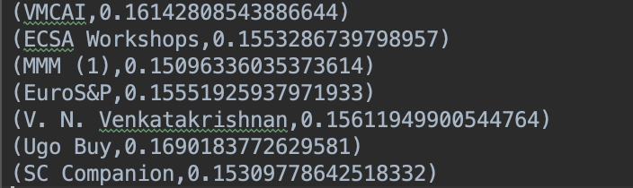

# PageRank using Apache Spark
## By Unaiza Faiz (651052450)

## Steps to run the program
1. Clone the repository to your local machine using 
``git clone git@bitbucket.org:unaizafaiz/unaiza_faiz_hw5.git ``
2. Go to the cloned repository location on your terminal and assemble the program using
``sbt clean compile assembly``
3. In order to run the program on Virtual machine copy the jar to the desired location in VM
``scp -P 2222 target/scala-2.12/unaiza_faiz_hw2-assembly-0.1.jar username@vm.address.com:<path_to_final_location>``
4. Create an input directory on hdfs and add the dblp.xml file to the directory 
5. Run the Spark program using the following command
`spark-submit --class PageRank --master "<worker_node_url>" unaiza_faiz_hw5-assembly-0.1.jar <path_to_input_directory_on_hdfs> <path_of_output_directory_on_hdfs> <pagerank_iterations>`

OR

6. In order to run the program locally, setup apache spark locally and navigate to the cloned repository on your terminal
7. Run the following command
`$SPARK_HOME/bin/spark-submit --class PageRank --master "spark://HOST:PORT" target/scala-2.11/unaiza_faiz_hw5-assembly-0.1.jar <path_of_input_file> <path_of_output_directory> <no_of_pagerank_iterations>`
Eg. 
`$SPARK_HOME/bin/spark-submit --class PageRank --master "spark://[master-hostname]:707" target/scala-2.11/unaiza_faiz_hw5-assembly-0.1.jar ~/Documents/dblp.xml ./src/main/resources/output 10`
8. The output of the spark application can be found in the Output directory location provided in the command above

##Input File
The dblp.xml file can be downloaded from [https://dblp.uni-trier.de/xml/](https://dblp.uni-trier.de/xml/)

##Output Sample

The complete output of the program can be found in unaiza_faiz_hw5/output folder

## Overview 

In the program, we aim at computing the page rank value of all the UIC authors and the respective venues where an article is published in the DBLP Publication dataset.
 
We consider a bidirectional link between two authors and a unidirectional link from an author to a venue.

There are 2 main classes that the program implements:

   1. PageRank.scala:
        This class contains the main program that configures Apache Spark. It parses the DBLP XML file using the [Databricks Spark XML](https://github.com/databricks/spark-xml) library to process the inputformat RDDs according to XML tags (here we use inproceedings tags).
        Each RDD is then parsed using the Utility.parse() method (see Utility.scala parse() method) that returns a List of edges of the form "author1     author2" and "author1    venue" for each input. Unique nodes and links are then extracted from this and
        pageRank is calculated for each node (authors and venues) using the [Apache Spark PageRank Example](https://github.com/abbas-taher/pagerank-example-spark2.0-deep-dive).
       
   2. Utility.scala:
     The Utiliy class contains various methods for the parsing of the XML.
   
          i. parse() returns a list of all the authors and venues, where each list is the author corresponding to one unique article and the venue where the article was published ("booktitle" tag)
          ii. createpairs() take a list of authors and returns all the pairs of authors in this list
          iii. replaceAlias() takes care of authors with slightly different names in different publications Eg. Ugo Buy, Ugo A. Buy
          iv. replaceUnicode() method replaces the unicodes characters in the text file before parsing the xml
           v. profLookUp() creates a lookup table of UIC professors
          vi. profMap() creates a hash map of all the professors with an alias 
        
## HortonWorks

HortonWorks Sandbox Virtual machine was used to configure Hadoop. VMware was used to run the VM.

## AWS

The program was also deployed to the AWS EMR (Elastic MapReduce). Please find the video of the same here:

[Spark Application on AWS](https://youtu.be/_KoxzR7b5oQ) 

